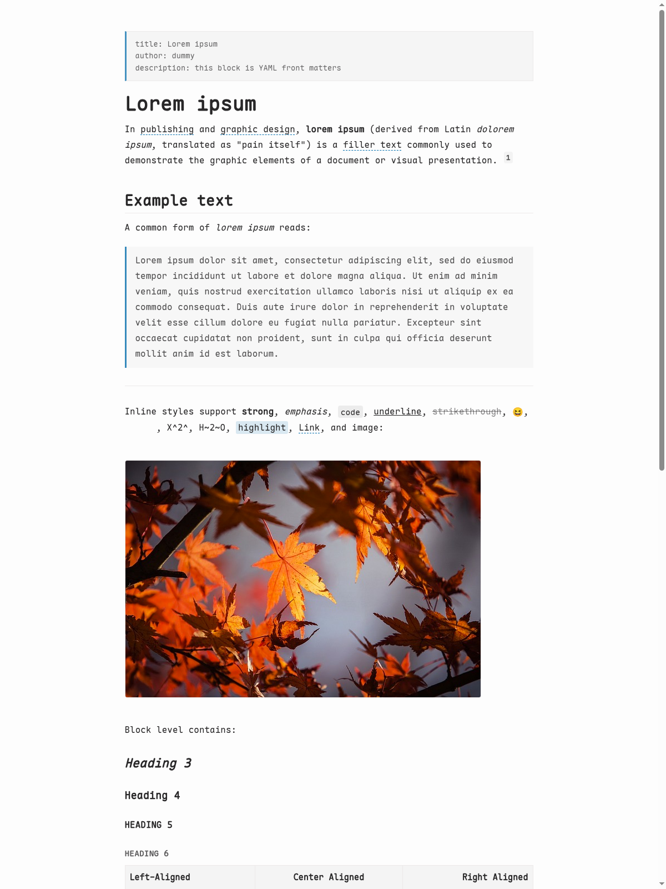
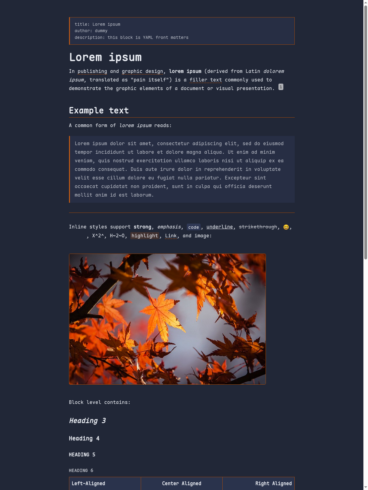

<p align="right">
  <a href="https://github.com/BinaryHusk/typora-theme-apaper/blob/main/README.md">
    English
  </a>
  /
  简体中文
</p>

<h1 align="center">
  Typora Theme - Apaper
</h1>

<p align="center">
  一个用于编辑 AstroPaper 风格 Markdown 文章的简洁 Typora 主题。
</p>

<div align="center">
  
  
</div>

## 预览

| 亮色 | 暗色 |
| :--: | :--: |
|  |  |

## 特性

- 贴近 AstroPaper 技术博客的视觉节奏。
- 采用紧凑、文本优先的布局，适合长篇 Markdown 编辑。
- 覆盖标题、列表、引用块、表格、代码块、数学公式、图表、原始 HTML 块、目录、脚注和 YAML Front Matter。
- 提供独立的 Apaper 与 Apaper Dark 主题文件，无需切换系统配色即可在 Typora 中选择暗色主题。
- 内置 Maple Mono CN，保持中英文文本渲染一致。

## 安装

1. 下载本仓库，或下载最新的 Release 压缩包。
2. 在 Typora 中打开 **偏好设置** > **外观** > **打开主题文件夹**。
3. 将 `apaper.css`、`apaper-dark.css` 和 `apaper` 文件夹复制到 Typora 主题文件夹。
4. 重启 Typora，并在主题菜单中选择 **Apaper** 或 **Apaper Dark**。

## 主题选择

| 系统或应用配色 | Typora 主题 |
| :-- | :-- |
| 亮色 | **Apaper** |
| 暗色 | **Apaper Dark** |
| 系统保持亮色，但希望 Typora 使用暗色编辑界面 | **Apaper Dark** |

Typora 会将 `apaper.css` 和 `apaper-dark.css` 识别为两个独立主题；当你想切换编辑界面的配色时，直接从 Typora 的主题菜单选择对应主题即可。

## 文件结构

```text
apaper.css
apaper-dark.css
apaper/
└── fonts/
    └── maple-mono-cn/
```

## 致谢

- 主题视觉参考 [AstroPaper](https://github.com/satnaing/astro-paper)。
- 字体资源来自 [Maple Mono](https://github.com/subframe7536/maple-font)。
- 主题结构和安装说明遵循常见 Typora 主题约定，并参考 [Lapis](https://github.com/YiNNx/typora-theme-lapis)。

## 许可证

Apaper 使用 [MIT License](./LICENSE) 发布。

内置 Maple Mono CN 字体文件使用 SIL Open Font License 1.1 单独授权。
